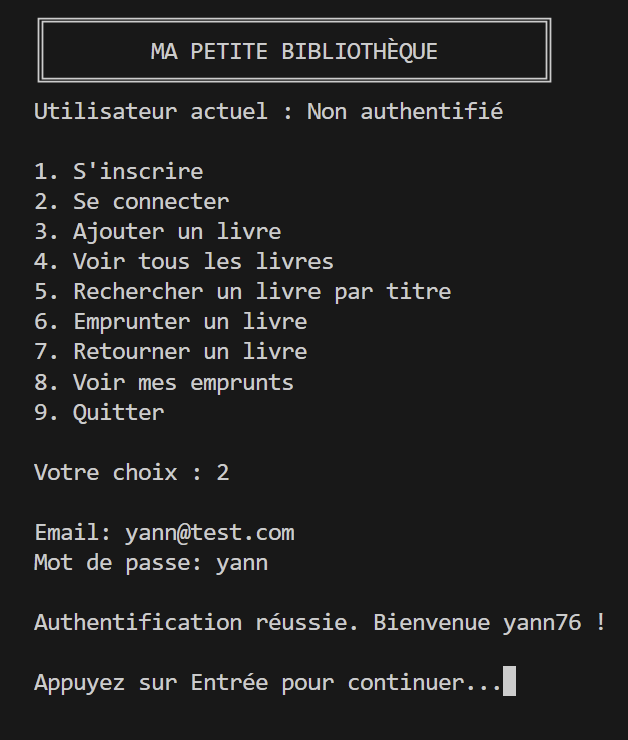
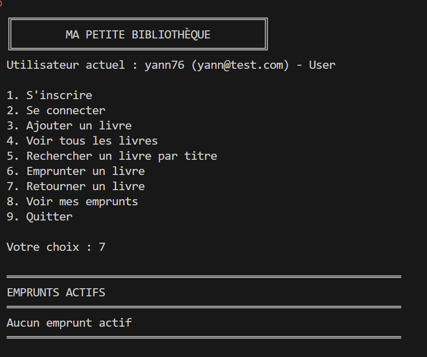

# 📚 Ma Petite Bibliothèque  
Application console Java illustrant différents design patterns logiciels.

---

## 🚀 Comment lancer le programme

### 1. Compilation

```bash
javac -encoding UTF-8 -d bin (Get-ChildItem -Recurse src\main\java\*.java)
```

### 2. Exécution

```bash
java -cp bin main.java.com.biblio.App
```

---

# 🧩 Design Patterns implémentés

| Pattern | Fichier(s) | Utilisation |
|--------|------------|-------------|
| **Singleton** | `DataStore` | Gère en instance unique la lecture/écriture JSON. |
| **Builder** | `Book.Builder`, `Loan.Builder` | Construction fluide d’objets complexes. |
| **Factory** | `NotificationFactory` | Génère la stratégie de notification adéquate. |
| **Strategy** | `NotificationStrategy` + implémentations | Définit le comportement d'envoi de notification. |
| **Repository** | `BookRepositoryImpl`, `UserRepositoryImpl`, `LoanRepositoryImpl` | Accès aux données + CRUD JSON. |
| **Service Layer** | `BookService`, `UserService`, `LoanService` | Logique métier centralisée. |
| **DTO** | `BookDTO`, `UserDTO`, `LoanDTO` | Séparation modèle / affichage. |
| **Observer** | `LoanSubject`, `LoanObserver`, `NotificationObserver` | Notification automatique lors d’un emprunt/retour. |

---

# 🖥️ Captures d’écran

## Menu principal


## Connexion réussie


## Emprunts actifs


---

# ✨ Fonctionnalités

- Inscription utilisateur  
- Connexion  
- Création automatique de l’administrateur  
- Ajout de livres (admin uniquement)  
- Consultation du catalogue  
- Recherche par titre  
- Emprunt d’un livre  
- Retour d’un livre  
- Visualisation des emprunts actifs  
- Persistance JSON  
- Notifications via Observer  


Un compte administrateur est généré automatiquement au lancement de l’application, et l’ensemble des données (utilisateurs, livres, emprunts) est stocké dans des fichiers JSON dans le dossier src/main/java/com/biblio/data.